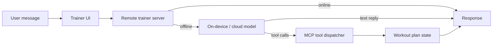

# GymBud

A cross-platform AI fitness coach that builds real workout plans and tracks real workouts.
GymBud ships the same core experience on iOS/watchOS and Android/WearOS, backed by a
shared trainer server and an on-device science knowledge base.

## Highlights

- AI trainer that can chat, generate multi-day plans, and modify existing plans
- Tool-calling workflow that writes directly into your saved plans (not just text)
- Evidence-based planning via a 2020-2025 exercise science synthesis with on-device RAG
- Watch and WearOS rep counting with calibration, fatigue detection, and wrist gestures
- Offline-friendly experience with local fallbacks when cloud services are unavailable

## Trainer Deep Dive

### 1) Multi-tier response pipeline

The trainer prioritizes reliability and speed by cascading across multiple sources.
The sequence is the same on both platforms.



- Remote server runs first to enable shared behavior across platforms.
- If unavailable, iOS falls back to on-device Gemma via LiteRT-LM.
- Android falls back to Gemini API; if not configured, it uses a local rule-based reply.

### 2) On-device coach (iOS)

GymBud iOS uses LiteRT-LM with the Gemma 4 E2B model to answer chats and optionally
invoke tools. The model runs locally on CPU for stability (Metal GPU is avoided due to
background thread restrictions in LiteRT-LM). The trainer can:

- Answer free-form questions (form, recovery, nutrition basics)
- Generate complete multi-day plans in one pass
- Modify existing plans by adding or removing days or exercises

### 3) Cross-platform MCP tool loop

Both platforms expose the same workout plan tools to the model. The trainer can call tools
instead of returning plain text, and the app executes them immediately.

Core tools (shared naming):

- create_workout_plan
- add_workout_to_plan
- remove_workout_from_plan
- add_exercise_to_workout
- remove_exercise_from_workout
- list_workout_plans
- get_workout_plan

This turns the AI into a plan editor that edits structured data, not just a chatbot.

### 4) Science RAG (evidence-based plan generation)

GymBud ships a comprehensive science synthesis covering modern training principles
(2020-2025). iOS uses on-device RAG to inject only the most relevant sections into
plan-generation prompts:

- Embeddings are created locally using the bundled CoreML MiniLM model
- Cosine similarity is computed with Accelerate for fast retrieval
- If the model is missing, a keyword-based fallback kicks in

Sources:

- iOS: GymBud/GymBud/Workout Science LLM Prompt Generation.md
- Android: GymBud_android/Workout Science LLM Prompt Generation.md

### 5) Remote trainer server (FastAPI)

The shared trainer server (GymBud_android/trainer_server.py) runs a lightweight
FastAPI app with an optional LiteRT-LM backend:

- POST /trainer/chat: Chat completions using Gemma (if model present)
- POST /embed: 384-dim normalized embeddings (all-MiniLM-L6-v2) when
  sentence-transformers is installed
- GET/PATCH /profile: Simple profile storage for goals
- GET/POST /kb/sleep and /kb/sleep/search: Example knowledge base endpoints

### 6) Safety and response tone

Trainer prompts explicitly enforce safe, concise coaching and avoid medical diagnosis.
When the model fails or tools are not used, the app provides conservative, low-risk
fallback responses.

## Platforms and Features

### iOS and watchOS

- SwiftUI app with LiteRT-LM on-device inference
- GymViewModel owns workout plans, chat history, and profile state
- WatchOS rep counting with warmup calibration and fatigue mode
- Phone-watch sync for rest timers, rep count, and workout events

### Android and WearOS

- Kotlin + Jetpack Compose, single-activity architecture
- Gemini tool calling for plan generation
- WearOS rep counting using a two-phase calibration state machine
- DataStore for account info and JSON snapshot for full state

## Architecture Map

```
AppDevelopment/
  GymBud/                 # iOS + watchOS (Swift, SwiftUI)
  GymBud_android/         # Android + WearOS (Kotlin, Compose)
  GymBud_android/trainer_server.py
```

Key files:

- GymBud/GymBud/AIManager.swift
- GymBud/GymBud/GymViewModel.swift
- GymBud/GymBud/WorkoutScienceRAG.swift
- GymBud_android/app/src/main/java/com/example/hackathon/GymApp.kt
- GymBud_android/app/src/main/java/com/example/hackathon/McpTools.kt

## Getting Started

## Required Downloads (Models)

Before running the trainer features, download the following model file and place it in the
correct locations:

- gemma-4-E2B-it.litertlm
  - iOS on-device trainer: place it in GymBud/GymBud/ and add it to the Xcode app bundle target
  - Trainer server: place it in GymBud_android/ next to trainer_server.py

Optional (server embeddings):

- all-MiniLM-L6-v2 (downloaded automatically by sentence-transformers on first run)

### iOS

1) Open GymBud/GymBud.xcodeproj in Xcode
2) Ensure gemma-4-E2B-it.litertlm is added to the app bundle target
3) Build and run on iPhone or Simulator
4) Run the Watch target with a paired watch or Watch Simulator

API keys (iOS):
- Edit GymBud/GymBud/GymViewModel.swift and replace placeholders
  for exerciseDbApiKey and pixabayApiKey

### Android

From GymBud_android/:

```
./gradlew assembleDebug
./gradlew :wear:assembleDebug
```

API keys (Android) in ~/.gradle/gradle.properties:

```
GEMINI_API_KEY=...
EXERCISE_DB_API_KEY=...
EXERCISE_DB_HOST=edb-with-videos-and-images-by-ascendapi.p.rapidapi.com
PIXABAY_API_KEY=...
```

### Optional trainer server (dev/testing)

iOS runs the trainer fully on-device by default. The server is optional and only
used if it is running and reachable (useful for shared behavior across platforms
or for local testing).

From GymBud_android/:

```
pip install fastapi uvicorn litert-lm
uvicorn trainer_server:app --reload
```

Notes:
- The server expects gemma-4-E2B-it.litertlm in the same folder
- iOS uses on-device inference unless the server is reachable
- iOS Simulator can reach a Mac-hosted server at http://127.0.0.1:8000/trainer/chat
- Physical iPhone: use your Mac LAN IP instead of 127.0.0.1 if testing the server
- Android emulator connects to http://10.0.2.2:8000/trainer/chat

## Testing

Android tests:

```
./gradlew test
./gradlew connectedAndroidTest
```

## Demo Assets (Soon)
TODO:
Add screenshots and short demo clips here:

- docs/screenshots/...
- docs/demo.mp4

## FAQ

**Does the trainer work offline?**
Yes. iOS can run the model fully on-device. Android falls back to a local rule-based
response when Gemini or the server is unavailable.

**How does the trainer edit plans?**
The model emits structured tool calls (MCP-style). The app executes them immediately
and updates the plan state.

**Can I replace the model?**
Yes. The on-device model is loaded from the bundle (iOS) or from the server runtime
(GymBud_android/trainer_server.py). Swap the model file to experiment.

## License

Add your license here.
